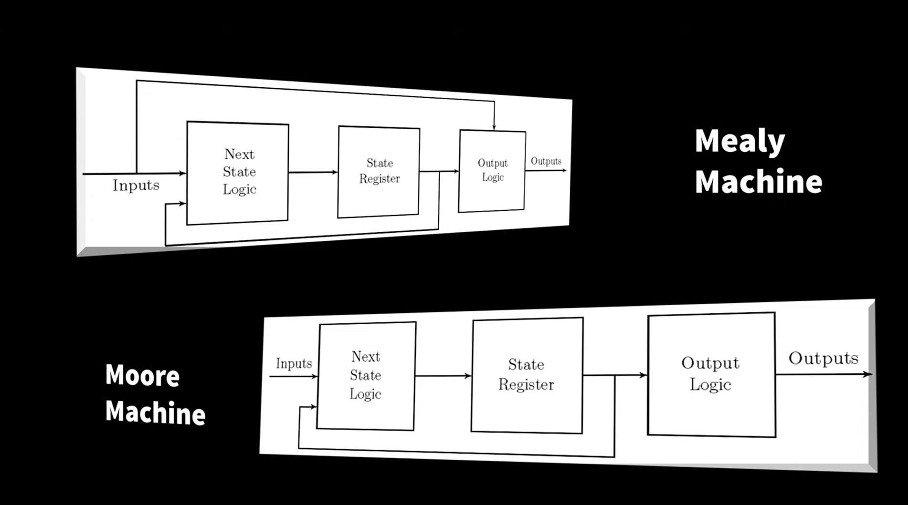

# finite_state_model_examples
The repository consist of verilog code and testbench for simple test benches
FSM are finite state machine.
The output of this machine is finite or singular depending on the input.
There are varies types of finite state machines- Mealy and Moore.

-- image credits: https://youtu.be/tzxaf-CNU3Q?si=QtgpCrI3O288x6-h
