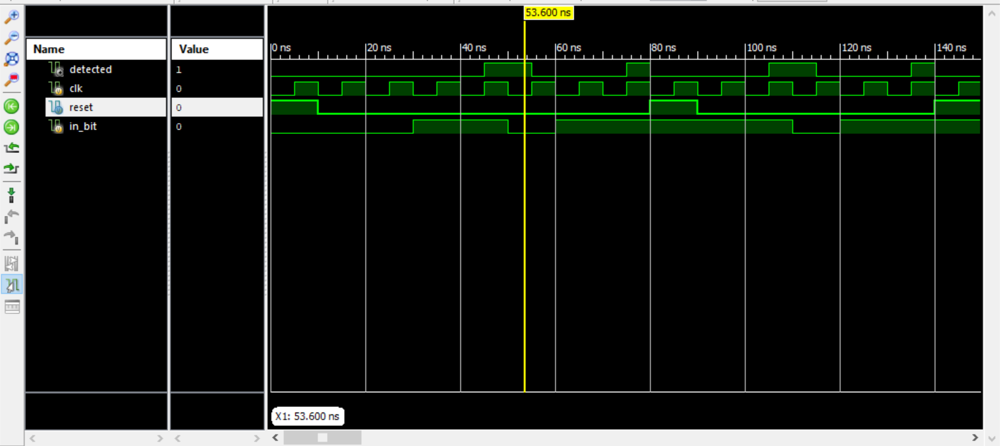
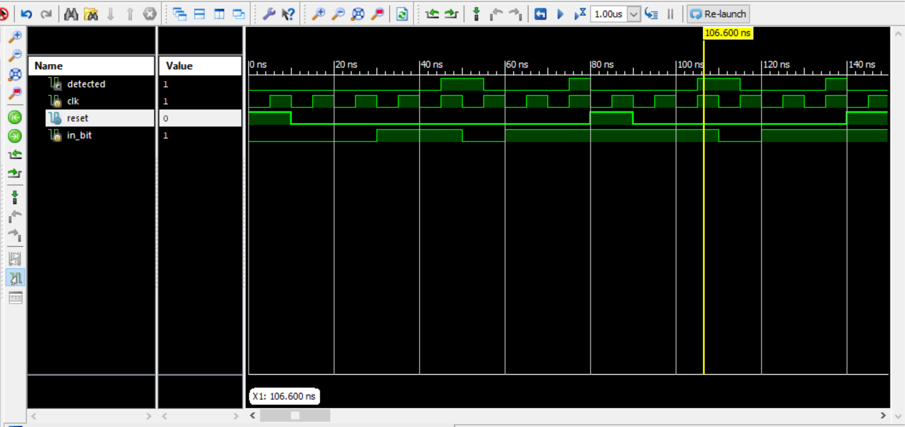
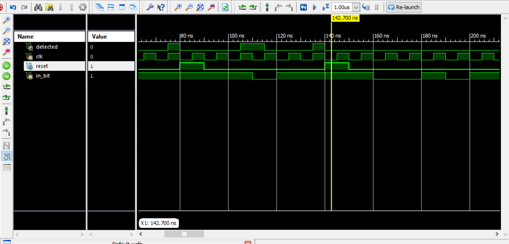

# CODTECH TASK 1
**Name:** Apoorva Amargol

**Company:** CODTECH IT SOLUTIONS

**ID:** CT08DS6751

**Domain:** VLSI

**Duration:** AUGUST to SEPTEMBER (2024)

**Mentor:** Muzammil Ahmed

________
  Overview of the task 1: Finite state machine

  
The repository consist of verilog code and testbench for simple test benches
FSM are finite state machine.
The output of this machine is finite or singular depending on the input.
There are varies types of finite state machines- Mealy and Moore.

-- image credits: https://youtu.be/tzxaf-CNU3Q?si=QtgpCrI3O288x6-h

-----------
 __THE FOLLOWING IS MY PROJECT SUMMARY__
 
This Verilog code defines a Finite State Machine (FSM) that detects the occurrence of two consecutive 1s in an input bitstream. 
- Inputs and Outputs
-- clk: The clock signal that drives the FSM.
-- reset: A reset signal that initializes or resets the FSM to its starting state.
-- in_bit: The input bitstream, where the FSM will look for the pattern 11.
-- detected: The output signal that is asserted (set to 1) when the pattern 11 is detected.

- State Encoding
  - The FSM has three states, which are encoded as two-bit values using localparam. In verilog 'localparam' is used to define constants.
  - S0 (2'b00): The initial state where the FSM waits for the first 1.
  - S1 (2'b01): The state where the FSM has detected the first 1 and is waiting for the second 1.
  - S2 (2'b10): The state where the FSM has detected the sequence 11.

- State Transition Logic
  - The always @(posedge clk or posedge reset) block is responsible for updating the current state (state) based on the clock signal (clk). If the reset signal is active, the FSM resets to the initial state (S0). Otherwise, it transitions to the next state (next_state).
  
- Next State and Output Logic:
  -The always @(*) block contains the combinational logic that determines the next state (next_state) and the output (detected) based on the current state and the input bit.
  - S0 (Initial State): If the input bit (in_bit) is 1, the FSM transitions to state S1. If the input bit is 0, the FSM remains in S0. detected is set to 0.
  - S1 (First '1' Detected): If the input bit is 1, the FSM transitions to state S2 because it has detected the sequence 11. If the input bit is 0, the FSM returns to state S0 because the sequence is interrupted. detected is set to 0.
  - S2 (Sequence "11" Detected): The output detected is set to 1, indicating that the sequence 11 has been detected. If the input bit is 1, the FSM transitions back to state S1 because it could be the start of a new sequence. If the input bit is 0, the FSM returns to state S0.

- Default Case: If, for some reason, the FSM ends up in an undefined state, it will reset to S0, and the output detected will be 0

HERE IS THE IMAGE OF SIMULATION at different instants:

1

2

3

